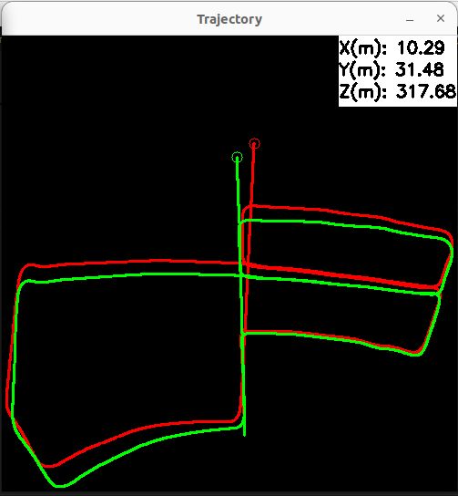
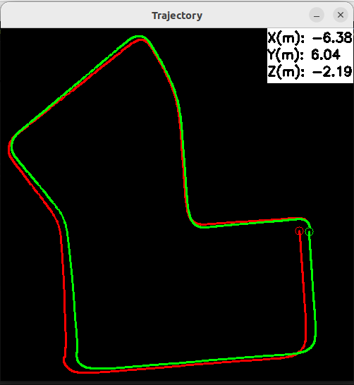
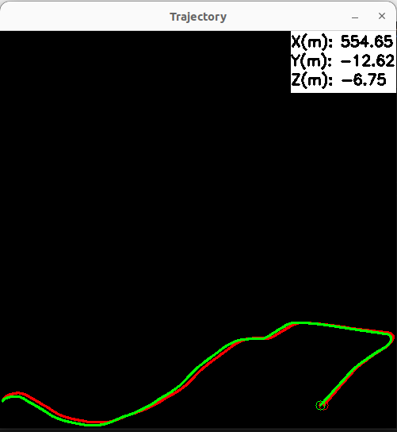

# ARM-VO

ARM-VO is a monocular visual odometry algorithm designed for on-road vehicles. It is highly optimized for ARM CPUs as it uses NEON C intrinsics and multi-threading to accelerate keypoint detection and tracking. 

## Results on KITTI dataset
| Sequence 05 | Sequence 07 | Sequence 10 |
|:---:|:---:|:---:|
|  |  |  |

## What's new in v2?
- Results are deterministic
- Scale estimation is more accurate (but slower)
- Camera pitch angle is no longer required (providing camera height is enough)
- RGB and BGR inputs are supported
- Distorted images are supported
- Keypoint tracking is faster by re-using KLT pyramids
- Motion estimation is more robust in dynamic environments
- The API and the implementation are much cleaner
- Added Python bindings
- Enabled compilation on x86 machines to simplify development
- Removed ROS node examples (will be back in future)

## Dependencies
- C++17 (or above)
- CMake >= 3.20 and build essentials
  ```bash
  sudo apt install build-essential git cmake pkg-config
  ```

- OpenCV
  ```bash
  git clone --branch 4.10.0 --depth 1 https://github.com/opencv/opencv.git
  cd opencv
  mkdir build && cd build
  cmake -DCMAKE_BUILD_TYPE=Release -DCMAKE_INSTALL_PREFIX=/usr/local -DBUILD_TESTS=OFF -DBUILD_PERF_TESTS=OFF -DBUILD_DOCS=OFF -DBUILD_EXAMPLES=OFF -DENABLE_NEON=ON -DBUILD_opencv_python2=OFF -DBUILD_opencv_python3=OFF ..
  make -j$(nproc)
  sudo make install
  sudo ldconfig
  ```

- ncnn
  ```bash
  git clone --recursive --depth 1 --branch 20241226 https://github.com/Tencent/ncnn.git
  cd ncnn
  mkdir build && cd build
  cmake -DCMAKE_BUILD_TYPE=Release -DCMAKE_CXX_STANDARD=17 -DCMAKE_INSTALL_PREFIX=/usr/local -DNCNN_BUILD_TESTS=OFF -DNCNN_BUILD_EXAMPLES=OFF -DNCNN_BUILD_BENCHMARK=OFF -DNCNN_THREADS=ON -DNCNN_OPENMP=OFF -DNCNN_VULKAN=ON  -DNCNN_ENABLE_LTO=ON ..
  make -j$(nproc)
  sudo make install
  sudo ldconfig
  ```

- TensorRT 8.6 (optional)
  
  ARM-VO will run faster if TensorRT is available. It'll be preferred over ncnn automatically when found.

- Catch2 v2 (only if you want to build tests as well)
  ```bash
  git clone --branch v2.13.10 --depth 1 https://github.com/catchorg/Catch2.git
  cd Catch2
  mkdir build && cd build
  cmake -DCMAKE_BUILD_TYPE=Release -DCMAKE_CXX_STANDARD=17 -DCMAKE_INSTALL_PREFIX=/usr/local -DCATCH_BUILD_STATIC_LIBRARY=ON -DCATCH_BUILD_TESTING=OFF -DCATCH_INSTALL_DOCS=OFF -DCATCH_INSTALL_HELPERS=ON ..
  make -j$(nproc)
  sudo make install
  sudo ldconfig
  ```

- Pybind11 and NumPy (only if you want to build Python bindings as well)
  ```bash
  python3 -m pip install pybind11 numpy
  ```

## How to build?
```bash
git clone https://github.com/zanazakaryaie/ARM-VO.git
cd ARM-VO
mkdir build && cd build
cmake -DCMAKE_BUILD_TYPE=Release ..
make -j$(nproc)
sudo make install
sudo ldconfig
```
### Build Options

| Option | Default | Description |
|---|---:|---|
| `BUILD_TOOLS` | `ON` | Build the tools library (contains helper utilities) |
| `BUILD_CLI` | `ON` | Build the command-line tools. This option is enabled only when `BUILD_TOOLS` is also enabled |
| `BUILD_PYTHON_BINDINGS` | `OFF` | Build the Python bindings for the core ARM-VO library |
| `BUILD_TESTS` | `OFF` | Build unit tests |

## Run on KITTI dataset
Download the odometry dataset from [here](https://s3.eu-central-1.amazonaws.com/avg-kitti/data_odometry_color.zip) and
build ARM-VO with `-DBUILD_CLI=ON`. Then, open a terminal, navigate to build/cli folder and run:
```bash
./run_armvo --image_folder=path/to/downloaded/images/folder --config=path/to/config.yaml
```
To compare ARM-VO's accuracy with ground-truth poses, first download the ground-truth data from [here](https://s3.eu-central-1.amazonaws.com/avg-kitti/data_odometry_poses.zip). Then navigate to build/cli folder and run:
```bash
./run_armvo --image_folder=path/to/downloaded/images/folder --config=path/to/config.yaml --gt_poses=path/to/ground-truth/poses/foo.txt
```

## How to use ARM-VO in your C++ project?
If your project uses CMake, you can find the installed ARM-VO package and link
against the core visual odometry library:
```cmake
find_package(armvo REQUIRED CONFIG)
target_link_libraries(my_app PRIVATE armvo::ArmVO)
```

The package also exports `armvo::ArmVOtools` for helper utilities when ARM-VO is
built with `BUILD_TOOLS=ON`. You can link it by:
```cmake
find_package(armvo REQUIRED CONFIG)
target_link_libraries(my_app PRIVATE armvo::ArmVO armvo::ArmVOtools)
```

## Python bindings
If you pass `-DBUILD_PYTHON_BINDINGS=ON` to CMake, ARM-VO can be used as a Python package.

Example:
```python
import numpy as np
import armvo

config = armvo.ArmVoConfig.load("cli/KITTI_configs/rectified/Seq00-02.yaml")
vo = armvo.ArmVo(config)

frame = np.zeros((480, 640), dtype=np.uint8)
status, pose = vo.initialize(frame)

print(status)
if pose is not None:
    print(pose.rotation)
    print(pose.translation)
```

## Limitations
- ARM-VO recovers the scale if 1) the camera height is fixed and 2) the scene contains road. Thus, it is NOT applicable for drones, hand-held cameras, or off-road vehicles.
- The algorithm detects small inter-frame translations and pure rotations using GRIC but it doesn't decompose the estimated homography matrix. Track is lost if the camera rotates too much without translation.

## Notes
- If you get low FPS on single-board computers (e.g. Raspberry Pi), check your power adapter.
- ARM-VO 2.0 leverages a low-resolution (320x640) BisenetV2 segmentation model to 1) estimate scale, and 2) perform better in dynamic scenes. You can increase or decrease the resolution to trade-off between accuracy and FPS. Check [here](docs/segmentation.md) to read more and go through the required steps.
- If you use ARM-VO in an academic work, please cite: <br />
```
@article{nejad2019arm,
  title={ARM-VO: an efficient monocular visual odometry for ground vehicles on ARM CPUs},
  author={Nejad, Zana Zakaryaie and Ahmadabadian, Ali Hosseininaveh},
  journal={Machine Vision and Applications},
  volume={30},
  number={6},
  pages={1061--1070},
  year={2019},
  publisher={Springer}
}
```

## For Developers

### Repository Layout

```text
.
├── cli/             Command-line tools for running ARM-VO
├── cmake/           CMake scripts
├── docs/            Documentation and README assets
├── lib/             Core ARM-VO implementation and Python bindings
├── model/           BiseNetv2 model
├── tools/           Utilities for visualization, evaluation, etc.
└── CMakeLists.txt   Main CMake build file
```

### Running Tests
If you build ARM-VO with `-DBUILD_TESTS=ON`, you can run tests from the repo root by:
```bash
 ctest --test-dir build --output-on-failure
```
Alternatively, you can navigate to `build/lib/tests` or `build/tools/tests` and run `test_*` executables one by one.

## TODOs
- Increase test coverage
- Add ROS 1 and ROS 2 examples
- Add redundancy for scale estimation (e.g. object priors)
- Support Bazel
