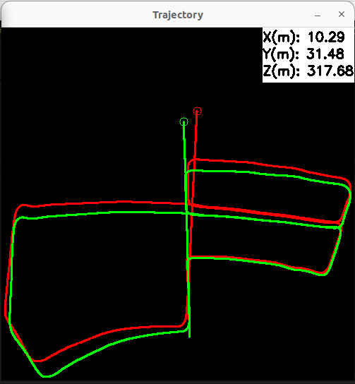
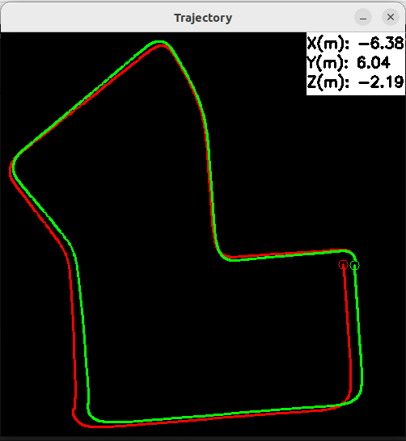
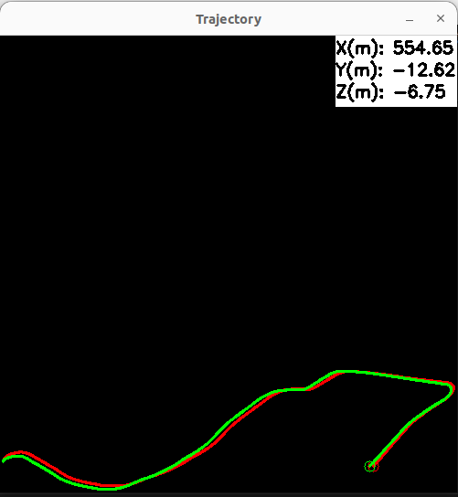

# ARM-VO

ARM-VO is an efficient monocular visual odometry library for on-road vehicles. It recovers scale using a known, fixed camera height and visible road. NEON intrinsics and multithreading accelerate keypoint detection and tracking.

## Results on KITTI dataset

| Sequence 05 | Sequence 07 | Sequence 10 |
|:---:|:---:|:---:|
|  |  |  |

## What's new in v2?
- Results are deterministic
- Scale estimation is more accurate
- Camera pitch angle is no longer required (providing camera height is enough)
- RGB and BGR inputs are supported
- Distorted images are supported
- Keypoint tracking is faster by re-using KLT pyramids
- Motion estimation is more robust in dynamic environments
- The API and the implementation are much cleaner
- Added Python bindings
- Enabled x86 to simplify development
- Added CI
- Removed ROS node examples (will be added in a near future)

## Build and install

ARM-VO requires C++17, CMake 3.20+, OpenCV 4.10+, and either ncnn or TensorRT 8.6.x (TensorRT is preferred if available). Note that you don't need to install all of the mentioned dependencies. ARM-VO will first check your system to find most of them. If not found, it'll start to fetch and build them (needs network obviously).So, all you need to do is to install build dependencies:

```bash
sudo apt install build-essential git cmake pkg-config libprotobuf-dev protobuf-compiler
```

Then build and install ARM-VO:

```bash
git clone https://github.com/zanazakaryaie/ARM-VO.git
cd ARM-VO
mkdir build && cd build
cmake -DCMAKE_BUILD_TYPE=Release ..
make -j$(nproc)
sudo make install
sudo ldconfig
cd ..
```

#### Uninstall

Keep the build directory after installation: it contains the uninstall script
and separate manifests for ARM-VO and dependencies installed by this build.
From the build directory, uninstall ARM-VO:

```bash
sudo make uninstall
sudo ldconfig
```

To also remove dependencies that ARM-VO built and installed:

```bash
sudo make uninstall-with-dependencies
sudo ldconfig
```

#### Build Options

| Option | Default | Purpose | Extra dependencies |
|---|---|---|---|
| `BUILD_TOOLS` | `ON` | Visualization, evaluation, and model conversion utilities | None |
| `BUILD_CLI` | `ON` | Command-line tools; requires `BUILD_TOOLS=ON` | None |
| `BUILD_PYTHON_BINDINGS` | `OFF` | Python API | `python3 -m pip install pybind11 numpy` |
| `BUILD_TESTS` | `OFF` | Unit tests | Catch2 v2.13.10: automatically detected if available, otherwise fetched and built by CMake. |

## Run on KITTI dataset

Download the [color odometry images](https://s3.eu-central-1.amazonaws.com/avg-kitti/data_odometry_color.zip). From the ARM-VO repository root, run with the matching [configuration](cli/KITTI_configs/rectified):

```bash
./build/cli/run_armvo --image_folder=/path/to/sequences/00/image_2 --config=cli/KITTI_configs/rectified/Seq00-02.yaml
```

To evaluate accuracy, download the [ground-truth poses](https://s3.eu-central-1.amazonaws.com/avg-kitti/data_odometry_poses.zip) and add `--gt_poses=path/to/poses/00.txt` to the above command.

## How to use ARM-VO in your project?

Check the [C++ example](examples/cpp) or [Python example](examples/python) to see how to use ARM-VO in your project.

## Limitations
- The camera height and road requirements make ARM-VO unsuitable for drones, handheld cameras, or off-road vehicles.
- Large rotations without translation can lose tracking.

## Notes
- ARM-VO leverages a low-resolution (320x640) BisenetV2 segmentation model to 1) estimate scale, and 2) perform better in dynamic scenes. You can increase or decrease the resolution to trade-off between accuracy and FPS. Check [here](docs/segmentation.md) to read more and go through the required steps.
- If you get low FPS on single-board computers (e.g. Raspberry Pi), check your power adapter.

## For Developers
#### Repository Layout

```text
.
├── 3rd-party/       Dependency setup for OpenCV, ncnn, and Catch2
├── cli/             Command-line tools for running ARM-VO
├── cmake/           CMake scripts
├── docs/            Documentation and README assets
├── examples/        C++ and Python usage examples
├── lib/             Core ARM-VO implementation and Python bindings
├── model/           BiseNetv2 model
├── tools/           Utilities for visualization, evaluation, etc.
└── CMakeLists.txt   Main CMake build file
```

#### Running Tests
If you build ARM-VO with `-DBUILD_TESTS=ON`, you can run tests from the repo root by:
```bash
 ctest --test-dir build --output-on-failure
```

## License and citation

ARM-VO is [MIT licensed](LICENSE). For academic use, please cite:

```bibtex
@article{nejad2019arm,
  title={ARM-VO: an efficient monocular visual odometry for ground vehicles on ARM CPUs},
  author={Nejad, Zana Zakaryaie and Ahmadabadian, Ali Hosseininaveh},
  journal={Machine Vision and Applications},
  volume={30},
  number={6},
  pages={1061--1070},
  year={2019},
  publisher={Springer}
}
```

## TODOs
- Increase test coverage
- Add ROS examples
- Add redundancy for scale estimation (e.g. object priors)
- Support Bazel
